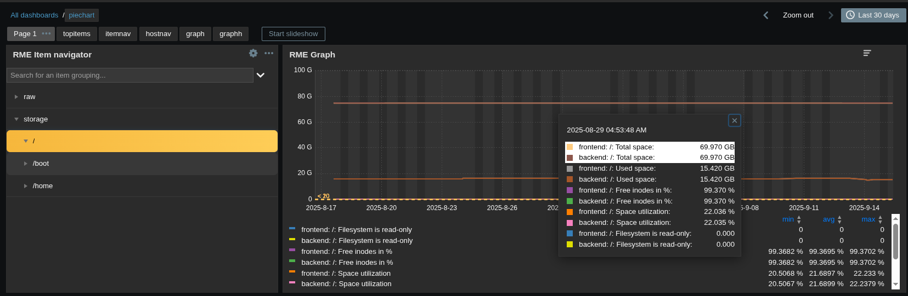

# zabbix-widgets-graph
An enhanced Graph Widget for the Zabbix Dashboard

[See the video demonstration!](https://www.youtube.com/watch?v=RD2ubhf-Vas)

# Graph Widget User Guide

This widget extends the standard graph functionality with a set of interactive features designed to make data exploration easier and more flexible.  

---

## 📊 Interactive Legend

- **Toggle Metrics On/Off**  
  Click on any legend item to show or hide its corresponding line/point/bar in the graph.  
  - **Single-click:** Toggles one metric at a time.  
  - **Ctrl + click:** Select or unselect multiple metrics.  

  ⚠️ *Note: Legend items must have unique names. If two metrics share the same name, toggling may not work correctly.*

- **Scrollable Legend**  
  If the number of metrics exceeds the legend space, a scroll bar appears so you can access all metrics.  

- **Sorting Legend Statistics**  
  You can sort the legend by **Max**, **Average**, or **Min** values.  
  *(Sorting by metric name is not yet supported.)*

- **Long Metric Names**  
  Long names are truncated with an ellipsis (…) but the full name appears when hovering with your mouse.  


---

## 🛠 Tooltip / Hintbox Enhancements

- **Point Highlighting**  
  When hovering over a point in the graph, that metric is highlighted in the tooltip.  

- **Sorting Options**  
  You can sort tooltip entries by **name**, ascendingly only, or **value**, in ascending or descending order.  

- **Improved Layout**  
  - Metric names are **left-aligned**.  
  - Values are **right-aligned**.  
  This makes it easier to scan large tooltips.  



---

## 🔄 Aggregation Features

- **New Functions**
  These functions are accessible in the `Data set` tab of the widget configuration in the `Aggregation function` dropdown list.
  - `itemCount` — counts the number of items.  
  - `sumOfAvg` — recommended for rate-based metrics (e.g., bps, packets/sec). This resolves inaccuracies with the standard `sum` function for rates.


- **Aggregate by Item Name**  
  Group multiple metrics by their item names using Zabbix built-in and usermacros.  
  - Combine this with macros (see below) for powerful custom aggregations.


 
- **Dynamic Change of Graph Toggle**  
  Three horizontal lines are present in the graph header that can be clicked to present different aggregation options.  
  - `Default view` - The original graph configuration.  
  - `Aggregate sum` - Sums all metric items in the graph.  
  - `Aggregate min` - Presents the minimum value of all metric items.  
  - `Aggregate max` - Presents the maximum value of all metric items.
  - `Aggregate avg` - Average all metrics items in the graph.
  - `Each metric` - Presents each metric
  The aggregation interval is hardcoded to '10m'. For now, this is not configurable


---

## 🧩 Data Set Configuration

- **Multiplier Option**  
  Apply a numeric multiplier to your metric values. This is available in the `Data set` tab of the widget configuration.   
  - Example: Convert **bytes → bits per second (bps)**.  
  - Example: Convert **0–1 percentage → 0–100 percentage**.  

- **Macros in Labels**  
  Customize how metrics appear in the legend using macros.  
  - Default format: `HOSTNAME: ITEMNAME`  
  - Example: `{ITEM.NAME}` → displays only the metric name.  
  - Example with regex:  

    ```text
    {{ITEM.NAME}.regrepl("CPU Usage - ", "")}
    ```
    Displays `"MyProcess"` instead of `"CPU Usage - MyProcess"`.  

For additional detail refer to [Zabbix Macro Functions Documentation](https://www.zabbix.com/documentation/7.4/en/manual/config/macros/macro_functions?hl=regsub)

---

## ⚙️ Display Options

- **Prune Zero-Only Metrics**  
  Enable the checkbox in `Displaying options` to hide metrics where all values are `0`.  
  If all metrics for an item or aggregate item or dataset are 0 for the selected time period this parameter will cause those metrics to be removed from the graph view pane.  


---

## 🎨 Color Handling Fix

- When aggregating by dataset, the color you select is now preserved exactly.  
- Previously, colors could shift due to hue adjustments when many metrics were aggregated.  


## Disruptively Innovative Modifications
- This widget has been modified to accept multiple itemids broadcasted from certain widgets in the gryan337 git repository. As of right now the [zabbix-widgets-itemnavigator](https://github.com/gryan337/zabbix-widgets-itemnavigator) module can broadcast multiple itemds. Soon, the Table widget will be able to (with significant advanced interactive functionality). More documentation coming soon!


# 🚀 Project Roadmap

A high-level view of our project milestones and upcoming goals.

---

## 📍 September 2025

- [x] Add the ability to change the graph aggregation with a drop-down selection or from the actions menu of the widget  
- [x] Basic documentation written along with screen shots of the enhancements  
- [ ] Final QA & bug fixes (please submit bugs!)  

---

## 🛠️ Upcoming (Q4 2025)

| Milestone | Status | Target |
|-----------|--------|--------|
| Crowd sourced feature requests | Upcoming | October 2025 |
| Research possibility of having the legend on the right side of the graph | 🔜 Planned | Q4 2025 |
| Research possibility of adding a header value for legend metric name which could permit sorting it | 🔜 Planned | Q4 2025 |
| Continuous improvement and listening to what users need | 🔜 Planned | Q4 2025 |

---

